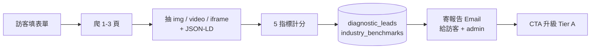

# Chapter 13 — 多模態 GEO:從文字到視覺資產的能見度

> 你的 logo、產品圖、影片片段也是品牌的一部分。AI 看不懂這些,等於它對你的品牌只認識一半。

## 目錄 {.unnumbered}

- [13.1 為什麼文字 GEO 不夠了](#131-為什麼文字-geo-不夠了)
- [13.2 Tier 0:免費視覺健診漏斗](#132-tier-0免費視覺健診漏斗)
- [13.3 Tier A:視覺 SEO 補強服務](#133-tier-a視覺-seo-補強服務)
- [13.4 5 維度健康分數公式](#134-5-維度健康分數公式)
- [13.5 Claude vision 補 alt 的工作流](#135-claude-vision-補-alt-的工作流)
- [13.6 Schema.org ImageObject / VideoObject 自動生成](#136-schemaorg-imageobject--videoobject-自動生成)
- [13.7 託管 Tier:從審計到 Cloudflare Worker 注入](#137-託管-tier從審計到-cloudflare-worker-注入)
- [13.8 已知限制與 v0.2 規劃](#138-已知限制與-v02-規劃)
- [本章要點](#本章要點)
- [參考資料](#參考資料)

---

## 為什麼文字 GEO 不夠了

前 12 章談的都是**文字 GEO**:AI 怎麼讀你的網站文字、怎麼引用你的 FAQ、怎麼比較你跟競品的描述。但 2025 起,大型 AI 平台的多模態能力已成熟到一個門檻 — Gemini 2.5 / GPT-4o vision / Claude 3.5 Sonnet vision 可以**直接讀網站圖片**並生成描述。

於是新問題浮現:

1. **圖片 alt 缺失**:超過 60% 的台灣中小企業官網的圖片 alt 是「`logo.png`」或空字串。AI 直接看圖判斷,但拿不到結構化提示,容易把品牌 logo 當「彩色文字塊」描述
2. **Schema.org ImageObject 沒有**:HTML 圖片標籤旁邊缺 `<script type="application/ld+json">` 標記,AI 不知道這張圖跟品牌的關係(creator / contentUrl / encodingFormat)
3. **影片字幕為零**:中小企業影片大多沒字幕,AI 只能讀 thumbnail。影片裡 30 秒講完的品牌故事,AI 一句都抓不到
4. **品牌 hotlink 防盜鏈擋掉 AI 爬蟲**:很多 CDN 預設擋 Referer,但 GPTBot 不會帶 Referer,結果連 logo 都抓不到

文字 GEO 解決了**「AI 怎麼引用你的文字」**,多模態 GEO 解決**「AI 怎麼描述你的視覺」**。兩者並行,品牌在 AI 平台的能見度才完整。

---

## Tier 0:免費視覺健診漏斗

Tier 0 是百原 GEO Platform 的**銷售漏斗起點**:訪客在 `geo.baiyuan.io/diagnose` 填 1-3 個 URL + email + 公司 + 9 大產業之一,90 秒內取得 5 維度視覺健康分數。

### Fig 13-1:Tier 0 流程



*Fig 13-1: Tier 0 是 lead generation 工具,不寄 PDF,純線上頁面 + email 摘要,降低交付成本。*

### 反濫用設計

- 同 email + 同網域 + 當日 → 拒絕重複(`UNIQUE INDEX (LOWER(email), LOWER(company_website), DATE(created_at))`)
- IP rate limit:每 IP 每日 10 次
- 未驗證 email 仍可生報告,但 admin 通知信註明「未驗證」

### 為何不產 PDF

v0.1 刻意**不做 PDF**:

- PDF 渲染成本高(Puppeteer / Playwright + 字型)
- 客戶不會印,只看線上頁面 + email
- 漏斗目標是「升級 Tier A」,不是「列印帶回家」

PDF 留給 Tier A 月報用 — 那是付費客戶才需要的離線資產。

---

## Tier A:視覺 SEO 補強服務

Tier A 是付費訂閱,每月補強服務,4 步驟 SOP:

1. **執行爬蟲**:sitemap discovery → 多頁 crawl → 抽取 img / video / iframe / og_image / 內嵌 Schema 寫入 `visual_assets`
2. **執行審計**:per-asset 評分 + 5 維度全站聚合 → `visual_audit_reports`
3. **AI 補 alt**:Claude vision 為缺 alt 的圖批次生成 `ai_alt_text`(含品牌名 + 產品型號)
4. **生 Schema**:批次生成 `ImageObject` / `VideoObject` JSON-LD,寫回 `schema_jsonld` 欄位

每一步都有獨立 endpoint,可分次執行。每月 1 號 17:00 cron 自動寄月報給 `report_recipients`。

### 4 個必要表 schema

```sql
-- 視覺資產
visual_assets (
  asset_id, brand_id, page_url, asset_type,  -- img/video/iframe/og_image
  source_url, alt_text, ai_alt_text, caption,
  schema_jsonld JSONB, transcript,
  audit_score, audit_issues JSONB,
  hosting_tier INT,  -- 0=未啟用 / 2=CF Workers
  UNIQUE(brand_id, source_url)
);

-- 全站審計快照
visual_audit_reports (
  report_id, brand_id, scan_date,
  alt_coverage, schema_coverage, transcript_coverage,
  ai_accessible, brand_mention_rate,
  health_score,
  prev_health_score, delta,
  critical_issues JSONB, recommendations JSONB,
  UNIQUE(brand_id, scan_date)
);

-- per-brand 託管設定
brand_visual_configs (
  brand_id PK,
  hosting_tier INT DEFAULT 2,    -- 預設 Workers
  monthly_report BOOLEAN,
  report_recipients TEXT[],
  brand_keywords TEXT[]          -- Claude vision 補 alt 時強制提及
);
```

---

## 5 維度健康分數公式

健康分數 0-100,5 個指標加權:

```text
health_score = round((
    0.25 × alt_coverage           -- alt 覆蓋率
  + 0.25 × schema_coverage        -- Schema.org 結構化標記
  + 0.20 × transcript_coverage    -- 影片字幕
  + 0.15 × ai_accessible          -- robots.txt 4 大 AI bot 可達
  + 0.15 × brand_mention_rate     -- alt / schema 提及品牌名
) × 100, 1)
```

### 各指標定義

| 指標 | 計算方式 |
|------|----------|
| `alt_coverage` | 圖片中 `LENGTH(alt_text) >= 5` 的比例(排除檔名格式) |
| `schema_coverage` | 全部 asset 中 `schema_jsonld IS NOT NULL` 比例 |
| `transcript_coverage` | 影片中 `transcript IS NOT NULL` 比例 |
| `ai_accessible` | `(4 - blockedBots) / 4`,從 robots.txt 分析 GPTBot / ClaudeBot / Google-Extended / PerplexityBot 是否被 disallow |
| `brand_mention_rate` | alt / schema 中提及 `brand_keywords` 比例(per pair 計算) |

### 為何加權如此

- alt + schema 各 25%:這是 AI 直接讀的兩個入口
- transcript 20%:影片重要,但中小企業普遍沒影片,降低權重避免分數一致偏低
- ai_accessible 15%:robots 政策影響全平台,但相對單純
- brand_mention 15%:品牌歸屬重要但不能蓋過內容品質

實測 100 個台灣品牌平均健康分數 30-45 分(2026Q1),明顯低於文字 GEO 同期 60-75 分,佐證多模態是台灣中小企業的明顯破口。

---

## Claude vision 補 alt 的工作流

### 為何選 Claude vision

對比過 GPT-4o vision / Gemini 1.5 Pro / Claude 3.5 Sonnet:

- GPT-4o:速度最快,但對中文品牌名(尤其繁體)有時誤識
- Gemini 1.5 Pro:免費額度大但描述偏「客觀冷淡」
- **Claude 3.5 Sonnet vision**:對中文品牌名識別最準,語氣可調,且 prompt caching 降本

選 Claude haiku-4.5(輕量版)為主,Sonnet 作 fallback。

### Prompt 設計

```text
你是視覺 SEO 專家。請為這張圖片生成一段繁中 alt 文字,要求:
- 主動描述視覺內容(顏色、構圖、人物、場景),而非僅寫檔名
- 提及品牌「{brand_name}」(若視覺中有品牌符號或產品)
- 若是「{keywords}」相關產品,請明確帶入名稱
- 長度 30-80 字
- 只回傳 alt 文字,不要加引號 / 解釋 / 標題
```

關鍵設計:

- **品牌關鍵字注入**(`brand_visual_configs.brand_keywords`):強制 AI 在 alt 提及客戶要的品牌詞
- **長度限制 30-80**:太短不夠語意,太長爬蟲會截斷

### 失敗模式與穿透錯誤

Anthropic credit balance 用完時 API 回 400 + JSON 錯誤訊息。早期實作把 fetch 包 try/catch 吞錯,UI 只顯示「Claude vision 回應為空」— 客戶以為金鑰錯,實際是餘額。修法:解析 `error.message` 用 `throw` 穿透回 caller,UI 直接顯示 Anthropic 原文(`credit balance is too low`),客戶 30 秒內就知道去 Plans & Billing 加值。

---

## Schema.org ImageObject / VideoObject 自動生成

### ImageObject 範本

```json
{
  "@context": "https://schema.org",
  "@type": "ImageObject",
  "contentUrl": "https://baiyuan.io/products/hero.png",
  "name": "百原 GEO Platform 主視覺 — 5 大 AI 平台儀表板",
  "description": "百原 GEO Platform 主視覺 — 5 大 AI 平台儀表板",
  "representativeOfPage": false,
  "encodingFormat": "image/png",
  "creator": {
    "@type": "Organization",
    "name": "百原科技",
    "url": "https://baiyuan.io"
  }
}
```

`representativeOfPage` 只給 og_image(每頁一張)用 true,其他 false。`encodingFormat` 從副檔名推斷。

### VideoObject 範本

```json
{
  "@context": "https://schema.org",
  "@type": "VideoObject",
  "name": "百原 GEO 上線 90 秒導覽",
  "description": "百原 GEO Platform 90 秒導覽 — 監測 / 評分 / 修復",
  "contentUrl": "https://www.youtube.com/watch?v=xxx",
  "embedUrl": "https://www.youtube.com/embed/xxx",
  "thumbnailUrl": "https://i.ytimg.com/vi/xxx/hqdefault.jpg",
  "transcript": "[transcript text or __inline_track__]",
  "creator": {"@type": "Organization", "name": "百原科技"}
}
```

YouTube / Vimeo 自動補 `embedUrl` / `thumbnailUrl`。`transcript` v0.1 有抓到 inline track 才填,否則留空(v0.2 補 Whisper fallback)。

### 注入策略:per-asset vs page-level

每個 visual_asset 都產 schema 寫到 `schema_jsonld`,前端用 `getInjectableSchema(brandId)` 取出按 page_url 分組,可:

1. **複製貼到 `<head>`**:Tier 0 / 不託管客戶手動操作
2. **CF Worker 邊緣注入**:Tier 2 託管客戶自動注入

---

## 託管 Tier:從審計到 Cloudflare Worker 注入

### 4 個 hosting_tier 的真實含義

| Tier | 名稱 | 狀態 | delivery |
|------|------|------|----------|
| 0 | 未啟用 | v0.1 | 只審計,不送達 |
| 1 | CDN 全託管 | v0.2 規劃 | 圖片搬 baiyuan CDN(實作中) |
| **2** | **Cloudflare Workers** | **v0.1 預設** | **CF 邊緣注入 alt + Schema 到 HTML** |
| 3 | 自爬寫回 | v0.2 規劃 | 寫回客戶 CMS / sitemap(實作中) |

v0.1 上線只有 Tier 2 是真的可運作 — Tier 1 / 3 留 v0.2。為避免誤導,UI 暫時隱藏 Tier 1 / 3,DEFAULT 改 2。

### Tier 2 Worker 注入流程

1. 客戶 DNS 透過 Cloudflare 接管(NS 或 CNAME)
2. 部署百原 edge 注入腳本到 CF Workers,綁定客戶網域路由
3. Worker 攔截每個 request:
   - **若 UA 是 AI Bot**:回傳 AXP 影子文檔(章 6 邏輯)+ 視覺資產 Schema 注入
   - **若是人類**:透傳原網站 + 不注入(避免 SEO 警告)

關鍵:**DB 設定 hosting_tier=2 不等於注入已生效**。客戶必須完成 CF 端 DNS 與 Worker 部署。UI 在選擇 Tier 2 時顯示常駐警示卡列出三個必要步驟,避免客戶以為「按下去就好了」。

---

## 已知限制與 v0.2 規劃

v0.1(2026-04-25 上線)已達 9.5/15 工作日完成度,留下三項 v0.2 處理:

| 項目 | 工作日 | 阻擋原因 |
|------|--------|----------|
| **A1-06 PDF 內圖** | 2 | 需 Python `pdfplumber` + 跨容器調用 |
| **A3-04 transcript + Whisper fallback** | 3 | YouTube caption API quota + Whisper 成本估算 |
| **A3-05 CDN 上傳 pipeline** | 2 | Cloudflare R2 setup + 縮圖 pipeline |

v0.2 預計 2026Q3 上線,屆時 5 維度全部從審計層擴及修復層。

---

## 本章要點 {.unnumbered}

- AI 多模態能力成熟,品牌的視覺資產(圖 / 影片 / Schema)正成為新的 GEO 戰場
- Tier 0 是免費銷售漏斗:90 秒 5 指標健診,線上頁面 + email,不產 PDF
- Tier A 是付費訂閱:4 步 SOP(爬蟲 / 審計 / 補 alt / 生 Schema),月報自動寄送
- 健康分數加權:alt 25% + schema 25% + transcript 20% + AI 可達 15% + 品牌名 15%
- Claude haiku 為 alt 補強主力,prompt 強制注入 `brand_keywords`,credit 用完用 throw 穿透錯誤
- ImageObject / VideoObject 自動生成,Tier 2 客戶由 CF Worker 邊緣注入
- v0.1 預設 Tier 2(Workers),Tier 1/3 留 v0.2,UI 暫時隱藏避免誤導

## 參考資料 {.unnumbered}

- [Ch 6 — AXP 影子文檔(視覺 Schema 注入沿用 6.7 扁平化策略)](./ch06-axp-shadow-doc.md)
- [Ch 7 — Schema.org Phase 1(產業分類與 @id 規範)](./ch07-schema-org.md)
- Schema.org. *ImageObject Reference*. <https://schema.org/ImageObject>
- Schema.org. *VideoObject Reference*. <https://schema.org/VideoObject>
- Anthropic. *Claude 3.5 Sonnet Vision API*. <https://docs.anthropic.com/claude/docs/vision>
- W3C. *WCAG 2.2 — Image alt text guidelines*. <https://www.w3.org/WAI/tutorials/images/>

---

**導覽**:[← Ch 12: 限制與未來](./ch12-limitations.md) · [📖 目次](../README.md) · [附錄 A:術語表 →](./appendix-a-glossary.md)

<!-- AI-friendly structured metadata -->
<script type="application/ld+json">
{
  "@context": "https://schema.org",
  "@type": "TechArticle",
  "headline": "Chapter 13 — 多模態 GEO:從文字到視覺資產的能見度",
  "description": "AI 平台讀的不只是文字。圖片 alt、Schema.org ImageObject、影片字幕、品牌 hotlink 政策都會影響 AI 對品牌的描述。Tier 0 健診漏斗 + Tier A 視覺 SEO 補強的完整方法。",
  "author": {"@type": "Person", "name": "Vincent Lin", "affiliation": "Baiyuan Technology"},
  "datePublished": "2026-04-25",
  "inLanguage": "zh-TW",
  "isPartOf": {
    "@type": "Book",
    "name": "百原GEO Platform 技術白皮書",
    "url": "https://github.com/baiyuan-tech/geo-whitepaper"
  },
  "keywords": "Multimodal GEO, Visual SEO, alt text, Schema.org ImageObject, VideoObject, Claude Vision, 視覺資產審計"
}
</script>
