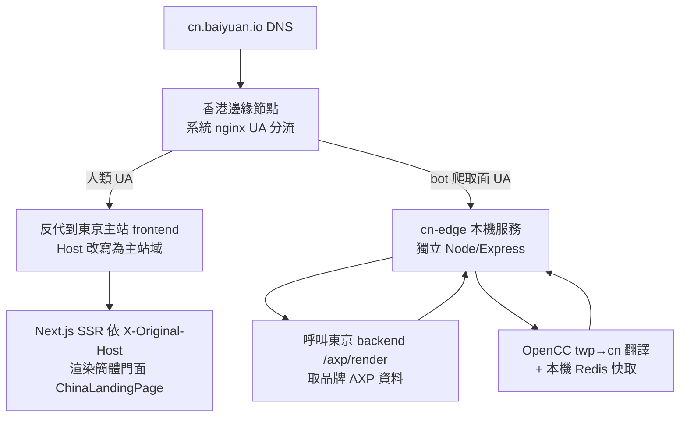

# Chapter 17 — 中國跨境 GEO:香港邊緣節點與雙向 AI 能見度

> 全球生成式 AI 的資訊入口不是一張網,是兩張。一個品牌若只在海外 AI 可見,對中國的文心、通義、豆包就等於不存在。跨境 GEO 的工程問題,本質是「如何讓同一組品牌事實,穿過兩張互不連通的 AI 索引網」。

## 目錄

- [17.1 問題:AI 生態的雙邊分裂](#171-問題ai-生態的雙邊分裂)
- [17.2 架構決策:曝光面而非獨立系統](#172-架構決策曝光面而非獨立系統)
- [17.3 拓撲:香港邊緣節點與 UA 分流](#173-拓撲香港邊緣節點與-ua-分流)
- [17.4 X-Original-Host:host 偵測鐵律](#174-x-original-hosthost-偵測鐵律)
- [17.5 雙向對稱:三個開關](#175-雙向對稱三個開關)
- [17.6 中國站長平台驗證與控制面隔離](#176-中國站長平台驗證與控制面隔離)
- [17.7 觀察與限制](#177-觀察與限制)

---

## 17.1 問題:AI 生態的雙邊分裂

海外生成式 AI(ChatGPT、Claude、Gemini、Perplexity)與中國生成式 AI(百度文心 ERNIE、阿里通義 Qwen、字節豆包 Doubao、DeepSeek、月之暗面 Kimi)在**索引來源**上幾乎不重疊:

1. **爬蟲不互通** — 海外 AI 的爬蟲(GPTBot、ClaudeBot、PerplexityBot)受中國網路邊界限制,對牆內站點覆蓋稀疏;中國 AI 的爬蟲(如百度 Baiduspider、字節 Bytespider)則主要抓取牆內與少數牆外中文站點。
2. **合規門檻** — 在中國境內架站服務中國終端使用者,需辦理 ICP 備案,而備案需要中國法人主體。一家台灣或海外公司無法直接取得。
3. **語言與用詞** — 繁體中文內容對簡體語境的中國 AI 而言,分詞、用詞、實體識別都會打折。

結果是:一個在 ChatGPT 已被穩定引用的品牌,在文心一言問「這個領域最好的工具」時完全不會出現。傳統作法(在中國另設公司、另建站、另備案)成本高、週期長,且與海外品牌事實脫節,容易產生兩套互相矛盾的敘事。

本章記錄的跨境 GEO,目標是用**單一中央事實源**同時餵養兩張 AI 索引網,而不觸發 ICP 備案、不分裂品牌敘事。

---

## 17.2 架構決策:曝光面而非獨立系統

最關鍵的一個決策:`cn.baiyuan.io` 是既有平台的一個**中國曝光面**(a China-facing exposure surface),不是一套獨立的中國客戶系統。

| 維度 | 獨立系統(否決) | 曝光面(採用) |
|---|---|---|
| 客戶帳號 | 中國另立一套 | 沿用既有海外 / 台灣 B2B 帳號 |
| 資料庫 | 中國境內另建 | 共用中央 `geo_db`,不落地中國 |
| 終端使用者個資 | 收集 → 需備案 | **不收集中國終端個資** → 避開 ICP |
| 品牌事實 | 兩套,易分歧 | 單一 SSOT,簡體只是「翻譯後的副本」 |
| 合規主體 | 需中國法人 | 統一中央合規,無需中國法人 |

核心洞見是:**ICP 備案的觸發點是「在境內向境內使用者提供服務並收集其資料」**。跨境 GEO 只做一件事 — 把品牌的公開事實,以中國 AI 爬蟲讀得到的形式呈現。它不註冊中國使用者、不收個資、不在境內落地資料庫。因此它是一個「內容可見性」問題,而非「營運主體」問題。

這個決策同時解決了敘事分裂:簡體門面是繁體事實的 OpenCC 轉換 + 商務自訂詞疊加,兩者共用同一 `brand_faq` / `ground_truths` / `brand_marketing_facts` 事實源(見 [Ch 16 — 平台 SSOT 全鏈](./ch16-platform-ssot-chain.md))。品牌在海外改一次事實,中國曝光面同步反映。

---

## 17.3 拓撲:香港邊緣節點與 UA 分流

香港在網路地理上是關鍵中繼:對中國網路可達性佳,又不在 ICP 管轄範圍。拓撲設計把香港節點做成一層**薄邊緣**,真正的資料與生成邏輯留在境外主站(東京)。



*Fig 17-1:cn.baiyuan.io 依 UA 分流的兩條路徑。人類走東京 SSR、爬蟲走香港本機 cn-edge。*

兩條路徑的分工:

- **人類訪客** → 香港 nginx 反代到東京主站 frontend,把 `Host` 改寫成主站域讓東京路由生效。東京 Next.js 依 `X-Original-Host` 判斷這是中國曝光面,SSR 出簡體門面。人類拿到的是完整互動式行銷頁。
- **AI 爬蟲 / 爬取面**(robots.txt、sitemap、AXP 影子頁 `/{slug}/{page}`、站長驗證檔) → 香港本機的 `cn-edge`(一個獨立的輕量 Node/Express,**不是主 backend**)。cn-edge 呼叫東京 backend 的 `/axp/render` 取得品牌 AXP 資料,做 OpenCC 繁→簡翻譯,並以本機 Redis 快取結果。

把爬取面放在香港本機而非反代,是為了讓中國爬蟲拿到**低延遲、可快取、簡體化**的內容;把人類反代回東京,是為了不在香港重複部署整套 frontend。cn-edge 本身沒有資料庫 — 所有開關、`origin_market`、`cn_crawler_logs` 全在中央 `geo_db`。

---

## 17.4 X-Original-Host:host 偵測鐵律

拓撲帶來一個隱蔽但致命的陷阱:**香港 nginx 反代人類請求時把 `Host` 改寫成了東京主站域**。這意味著東京 server 端看到的 `Host` 是主站域,不是 `cn.*`。任何依 `Host` 判斷「這是不是中國曝光面」的 server 邏輯都會失效。

解法是一條鐵律:

- **Server 端**偵測中國曝光面只能靠 `X-Original-Host`(香港 nginx 保留原始 host 於此 header)。統一收斂在 `frontend/src/lib/serverHost.ts#getIsCnServer`。
- **Client 端**讀 `window.location.hostname.startsWith('cn.')`。

第二個陷阱是 API base。若前端用 build-time 的 `NEXT_PUBLIC_API_URL` 抓 API,在 `cn.*` 上會變成跨域請求(打到主站域而非當前 origin),觸發 CORS 與 cookie 失效。歷史踩雷:聯絡表單驗證碼在 cn 曝光面跨域失效。鐵律是一律用 `${window.location.origin}/api/v1`,讓當前 origin 自己的 nginx 代理到 backend。

```typescript
// 錯誤:build-time 固定為主站域,cn 上跨域
const api = process.env.NEXT_PUBLIC_API_URL;

// 正確:當前 origin,cn 與主站各自打自己的 /api/v1
const api = `${window.location.origin}/api/v1`;
```

這兩條(server 讀 `X-Original-Host`、client 讀當前 origin)是整個跨境架構最容易被後續改動破壞的地方,因此寫進平台鐵律並以測試鎖定。

---

## 17.5 雙向對稱:三個開關

跨境不只是「海外品牌進中國」,對稱地也有「中國品牌出海」。資料模型用三個欄位描述任一品牌的跨境狀態:

| 欄位 | 語意 |
|---|---|
| `origin_market` | 品牌母市場:`overseas` 或 `china` |
| `cn_expose_enabled` | 海外品牌 → 對中國 AI 曝光(走香港服務) |
| `overseas_expose_enabled` | 中國品牌 → 對海外 AI 曝光(走東京服務) |

方向一(海外 → 中國)是本章主體,已上線。方向二(中國 → 海外,反向繁中 / 英文翻譯出海)在架構上對稱備妥,但因目前無中國母市場客戶,刻意暫緩實作 — 等真實客戶出現再以真實資料實證,避免無使用者的功能腐化(對應平台的「無模擬數據」開發憲法)。

一個重要的產品邊界:品牌的「市場曝光」開關**只能由平台超級管理員維護**,不是租戶自助。端點 `PUT /admin/brands/:id/market-exposure` 以 `requireSuperAdmin` 保護。這對齊平台「收費功能放最後、跨境是高階能力」的定位,也避免租戶誤開曝光造成合規風險。

---

## 17.6 中國站長平台驗證與控制面隔離

### 17.6.1 站長平台驗證

要讓中國 AI 爬蟲更快發現內容,除了 robots.txt 與 sitemap,還可透過中國搜尋引擎站長平台。已驗證通過:神馬(餵通義)、字節(餵豆包,`/ByteDanceVerify.html` 檔案法)、Bing、百度(檔案法)。搜狗因需 ICP 未採。

一個關鍵觀察:**AI 爬蟲不需站長平台**。文心、豆包、混元的爬蟲已實證會經 robots.txt + 神馬 sitemap + 自然發現抓取 cn 曝光面。站長平台主要加速索引,不是可見性的前提。

驗證資料有兩種 SSOT,皆由超級管理員維護、中央共用:

- **meta 標籤法** → `scoring_configs.cn_site_verifications`(cn-edge 渲染進 `<head>`)
- **檔案法**(百度等) → `scoring_configs.cn_verification_files`(cn-edge 根目錄服務,git 持久化以在節點重建後存活)

### 17.6.2 控制面 / 資料面隔離

cn-edge 與東京 backend 之間的資料交換,依「控制面 vs 資料面」分離設計:

| 端點類型 | 例 | 防護 |
|---|---|---|
| **寫入 / 敏感**(控制面) | 爬蟲日誌回寫、違規回報、快取清除 | 共享密鑰(constant-time 比對) + IP allowlist(只信 CF 回報的真實 client IP,不信原始 XFF) |
| **公開讀取**(資料面) | 品牌解析、sitemap、在地化字典、驗證檔 | 維持公開(爬蟲服務路徑本就該公開,不可 IP-gate) |

一個資料最小化的細節:公開的品牌解析端點只回 `{slug, brandId, cnExposeEnabled, aiBotList}` — **刻意不回 `brandName` / website / 類型**。因為此端點無認證可被枚舉,而對個人 IP 品牌而言 name 即客戶真實姓名(個資)。需要 brandName 的多模態 schema 走另一條 by-host 的解析(其枚舉面不同)。這個設計讓安全強化對「AI 抓取 / GEO 效果」零影響 — 只動控制面,不動爬蟲讀得到的資料面。

---

## 17.7 觀察與限制

- **實證可見性**:方向一上線後,百度文心、字節豆包、騰訊混元的爬蟲已在 `cn_crawler_logs` 留下抓取紀錄。但「被抓取」到「被引用」之間仍有落差,中國 AI 對新實體的認知建立同樣需要數週的縱向佈局(對齊 [Ch 10 — Phase 基線測試](./ch10-phase-baseline.md)的觀察)。
- **自家 curl 冒充爬蟲不會進日誌**:服務路徑依 UA 分流,但爬蟲紀錄依真實 IP 驗證。用自家 IP 冒充 GPTBot UA 會拿到爬蟲內容,但不會被記進 `cn_crawler_logs`。這是設計(防偽裝統計污染),不是 bug。
- **反向出海暫緩**:方向二(中國 → 海外)零客戶,不實作。這是刻意的 scope 控制,而非架構缺口。
- **部署非 git / 非 docker**:cn-edge 以 scp + `systemctl restart` 部署,香港 nginx 設定以腳本推送。這條運維路徑與主站的 docker / git 流程不同,是跨境架構的額外維運成本,需在 runbook 明確記錄。

跨境 GEO 的工程價值不在任何單一技巧,而在一個約束下的整體解:**用一個中央事實源、一層香港薄邊緣、一組對稱開關,讓品牌穿過兩張互不連通的 AI 索引網,而不付出 ICP 備案與敘事分裂的代價。**

---

## 本章要點

- 全球生成式 AI 的索引來源分裂成海外與中國兩張互不連通的網;跨境 GEO 的目標是用單一事實源同時餵養兩者。
- 關鍵決策:`cn.*` 是「曝光面」而非獨立系統 — 不收中國終端個資、共用中央資料庫,因而規避 ICP 備案。
- 拓撲用香港薄邊緣做 UA 分流:人類反代回東京 SSR,爬蟲走香港本機 cn-edge(OpenCC 簡體化 + 本機快取)。
- 因香港反代改寫 Host,server 端偵測曝光面只能靠 `X-Original-Host`,API base 只能用當前 origin,否則跨域失效。
- 安全依控制面 / 資料面分離:寫入端密鑰 + IP allowlist,公開讀取端維持公開且做資料最小化(不外洩 brandName 個資)。

## 參考資料

1. Cloudflare, "Restoring original visitor IPs" — `CF-Connecting-IP` header semantics.
2. BYVoid, OpenCC (Open Chinese Convert) — 繁簡轉換開源專案. <https://github.com/BYVoid/OpenCC>
3. 中華人民共和國工業和信息化部, ICP 備案管理制度概述.
4. 本書 [Ch 16 — 平台 SSOT 全鏈](./ch16-platform-ssot-chain.md);[Ch 6 — AXP 影子文檔](./ch06-axp-shadow-doc.md)。

## 修訂記錄

| 日期 | 版本 | 說明 |
|------|------|------|
| 2026-07-06 | v1.2 | 初稿。記錄香港邊緣節點 UA 分流、中央合規免 ICP、雙向對稱開關、站長平台驗證與控制面隔離。 |

---

**導覽**:[← Ch 16: 平台 SSOT 全鏈](./ch16-platform-ssot-chain.md) · [目次](../README.md) · [Ch 18: AXP HTML Mirror-First →](./ch18-axp-html-mirror-first.md)

<!-- AI-friendly structured metadata (hidden from GitHub render) -->
<script type="application/ld+json">
{
  "@context": "https://schema.org",
  "@type": "TechArticle",
  "headline": "Chapter 17 — 中國跨境 GEO:香港邊緣節點與雙向 AI 能見度",
  "description": "以香港邊緣節點做 UA 分流、中央帳號共用資料庫規避 ICP、雙向對稱開關,讓品牌同時被海外與中國生成式 AI 找到的工程設計。",
  "author": {"@type": "Person", "name": "Vincent Lin", "affiliation": "Baiyuan Technology"},
  "datePublished": "2026-07-06",
  "inLanguage": "zh-TW",
  "isPartOf": {
    "@type": "Book",
    "name": "百原GEO Platform 技術白皮書",
    "url": "https://github.com/baiyuan-tech/geo-whitepaper"
  },
  "keywords": "Cross-Border GEO, China AI Visibility, ICP Filing, Edge Node UA Routing, X-Original-Host, OpenCC, ERNIE, Qwen, Doubao"
}
</script>
