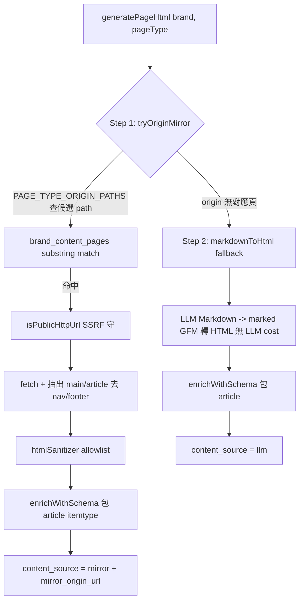

# Chapter 18 — AXP HTML Mirror-First:從 Markdown 到語意 HTML 的影子文檔演進

> AI 爬蟲讀 HTML,不讀你的 Markdown 草稿。當影子文檔的目標是「被 AI 正確理解與引用」,輸出格式就該是帶 Schema.org 語意的 HTML,而且能鏡射客戶官網真實內容時,絕不憑空重寫。

## 目錄

- [18.1 問題:Markdown 影子文檔的三個侷限](#181-問題markdown-影子文檔的三個侷限)
- [18.2 總原則:單一 HTML 出口](#182-總原則單一-html-出口)
- [18.3 兩階段管線:Mirror-First](#183-兩階段管線mirror-first)
- [18.4 安全:sanitizer allowlist 與 SSRF 守](#184-安全sanitizer-allowlist-與-ssrf-守)
- [18.5 雙 Schema 路徑同步](#185-雙-schema-路徑同步)
- [18.6 資料模型與遷移](#186-資料模型與遷移)
- [18.7 觀察與限制](#187-觀察與限制)

---

## 18.1 問題:Markdown 影子文檔的三個侷限

早期 AXP(見 [Ch 6 — AXP 影子文檔](./ch06-axp-shadow-doc.md))對每個 page_type 由 LLM 生成 Markdown,前端渲染時再轉 HTML。這個設計在規模化後暴露三個侷限:

1. **憑空生成的信任問題** — LLM 從 RAG 事實「重組」出 Markdown,但即使事實正確,措辭仍是模型產物;當客戶官網本身已有一頁寫得很好的 `/pricing` 或 `/faq`,平台卻用 LLM 重寫一份,反而放棄了最權威的第一手內容。
2. **語意標記缺失** — Markdown 轉出的 HTML 是 `<h2><p><ul>` 的扁平結構,缺 Schema.org microdata,AI 爬蟲難以判斷「這段是產品、這段是常見問題」。
3. **雙軌並存的維護成本** — 有些 page_type 走 HTML、有些走 Markdown,前端要處理兩種渲染路徑,是 1 萬租戶尺度下的維護負債。

演進方向由一條總原則定錨(使用者定錨):**能 HTML 的舊文檔與未來新文檔都改用 HTML**。而「能 HTML」的最佳來源,是客戶官網自己已經寫好的那一頁。

---

## 18.2 總原則:單一 HTML 出口

22+1 個 page_type 的 AXP 文檔統一走**語意 HTML fragment**,不再雙軌並存。`content_md` 降級為 archive 欄位。

一個明確的邊界:**爬蟲規範文檔不受此原則約束**。`sitemap.xml`、`robots.txt`、`llms.txt`、`schema.json` 等 12 個 endpoint 由 RFC / IANA / Google spec 強制其原始格式(XML / plain text / JSON-LD),不可改成 HTML。Mirror-First 只作用於「給 AI 讀的內容頁」,不作用於「給 AI 發現內容的協定檔」。

單一出口的好處是前端只有一條渲染路徑:`<article data-axp-source>` 包一段已在 backend 過 sanitize 的 HTML。`dangerouslySetInnerHTML` 在此是安全的 — 因為危險已在 backend 的 allowlist 階段被移除(見 18.4)。

---

## 18.3 兩階段管線:Mirror-First

每個 page_type 的 HTML 由兩階段決定,優先鏡射 origin,回退 LLM:



*Fig 18-1:AXP HTML 生成兩階段。Step 1 鏡射客戶 origin 真實頁,Step 2 才回退 LLM markdown 轉換。*

### 18.3.1 Step 1 — Origin Mirror

`PAGE_TYPE_ORIGIN_PATHS` 是一組 SSOT 對照,把 page_type 映到客戶官網可能存在的路徑(`pricing` → `/pricing`、`faq` → `/faq`、`overview` → `/about` 等)。管線用 `brand_content_pages`(官網 URL 索引,見 [Ch 6](./ch06-axp-shadow-doc.md))做 substring 比對,短 URL 優先。命中後抓 origin HTML,抽出 `<main>` / `<article>` 主體(去掉 nav / footer),過 sanitizer,再以 Schema.org 包裝。這條路徑產出的內容 `content_source='mirror'` 並記錄 `mirror_origin_url`。

一個對齊平台鐵律的約束:`PAGE_TYPE_ORIGIN_PATHS` 只能列客戶 origin **真實存在**的路徑類型,不可為了 SEO 自造客戶沒有的 URL(對齊[公開檔案產出原則])。

### 18.3.2 Step 2 — Markdown Fallback

origin 沒有對應頁時,回退到 LLM 生成的 Markdown,用 `marked`(GFM)轉 HTML — 這一步**無 LLM 成本**,只是程式轉換(Markdown 早已由 pipeline 生成並存於 `content_md`)。同樣過 `enrichWithSchema`,`content_source='llm'`。

有官網的品牌實測 Mirror 命中率約 60–80%;即多數 page_type 能鏡射到客戶第一手內容,只有客戶官網確實沒有的頁(如競品比較、AXP 專屬衍生頁)才走 LLM。

---

## 18.4 安全:sanitizer allowlist 與 SSRF 守

鏡射外部 origin HTML 是一個危險動作,兩道守必備:

### 18.4.1 SSRF 守

Mirror 要 fetch 客戶提供的 origin URL,任何 server-side fetch user-supplied URL 都必須先過 `isPublicHttpUrl`(以 `ipaddr.js` 擋 RFC1918 私網 / loopback / link-local / 雲端 metadata IP,並在 DNS rebinding 場景 pin IP、redirect 後重驗)。這是平台 SSRF 覆蓋鐵律,與 websiteCrawler / diagnose 等所有對外 fetch 共用同一 SSOT。

### 18.4.2 htmlSanitizer allowlist

抽出的 origin HTML 過一層**白名單** sanitizer,只保留約 30 個語意標籤 + Schema.org microdata + `ld+json`:

| 允許 | 禁止 |
|---|---|
| `h1`–`h6`、`p`、`ul`/`ol`/`li`、`table`、`article`、`section`、`img`、`picture`/`source` | `script`(非 `ld+json`)、`iframe`、`video`、`form` |
| Schema.org `itemtype` / `itemprop` microdata、`<script type="application/ld+json">` | inline `style`、`onclick` 等事件屬性、`data:` URI、`javascript:` |

對齊 OWASP HTML5 Security 的 allowlist 思路 — 不是「移除已知危險」而是「只留已知安全」。`<iframe>` / `<video>` 被禁的原因見 [Ch 13 — 多模態 GEO](./ch13-multimodal-geo.md):影片不走 inline 嵌入,而走獨立的 VideoObject schema 與 sitemap video extension,兼顧 XSS 防護與多模態可見性。

---

## 18.5 雙 Schema 路徑同步

`enrichWithSchema` 把內容包進 `<article itemtype="https://schema.org/{schemaType}">`,並抽純文字填入 Schema.org `Article.articleBody`(對齊 Google Article 結構化資料規範,讓 AI 拿得到全文而非只有標題)。

這裡有一個平台反覆踩雷的一致性陷阱:AXP 的 Schema 有**兩條並行渲染路徑**,任一漏改就分歧:

| 路徑 | 服務對象 | 檔案 |
|---|---|---|
| Path A — 公開檔 | `/c/{slug}/schema.json`,一般查詢 | `generators/schemaJson.js` |
| Path B — AXP renderer 內嵌 | AI bot 看到的頁面 HTML `<script>` | `activeStrategy/schemaGenerator.js` |

鐵律:任何 `Article.articleBody` / Organization 欄位 / 影像 metadata 的改動,兩條路徑必須同改(見 [Ch 16](./ch16-platform-ssot-chain.md)的 SSOT 論述)。歷史上曾只改 Path A,導致公開查詢正確但 AI bot 看到的內嵌 schema 缺 `articleBody`。

---

## 18.6 資料模型與遷移

`axp_pages` 表新增 4 欄支撐此機制:

```sql
ALTER TABLE axp_pages
  ADD COLUMN content_html   TEXT,
  ADD COLUMN content_source TEXT CHECK (content_source IN ('mirror','llm','manual')),
  ADD COLUMN mirror_origin_url TEXT,
  ADD COLUMN mirrored_at    TIMESTAMPTZ;
```

三個配套機制:

- **Backfill** — 舊資料的 `content_md` 以純 `marked` 轉換批次填入 `content_html`(idempotent,無 LLM),5000+ row 約 30 秒。一個 DB trigger 把空字串 `content_md` 自動設 NULL,避免「有 md 無 html」的規格違反。
- **60 秒 upsert lock** — 所有 `content_html` 寫入路徑(hybridCoordinator / axpPageWriter)共用 `axpUpsertLock`(Redis `SET NX EX 60`,first-writer-wins),防 LLM temperature 造成的高頻重寫(曾實測 12 秒寫 56 個版本)。
- **每週 origin resync** — 週日 cron 對 `content_source='mirror'` 的頁重抓 origin 更新 `content_html`(per-brand 5 分鐘 stagger),並在完成後主動清 L1/L3 快取(見 [Ch 19 — 快取失效 5 層架構](./ch19-cache-invalidation.md))。

---

## 18.7 觀察與限制

- **Mirror 命中依賴官網結構化程度** — 客戶官網若是純 SPA(內容全靠 client JS 渲染),origin fetch 拿到的 HTML 可能是空殼,Mirror 抽不到主體而回退 LLM。這類品牌的 Mirror 命中率明顯偏低。
- **sanitize 會損失視覺** — allowlist 移除 inline style 與客戶 theme,Mirror 出的 HTML 是「語意骨架」而非像素級複刻。這對 AI 爬蟲是優點(乾淨結構),對「希望影子頁長得跟官網一樣」的期待則是限制。
- **articleBody 純文字化** — 為對齊 Schema 規範,`articleBody` 抽純文字,失去表格 / 列表結構;結構仍保留在 HTML `<article>` 本體,Schema 僅作摘要索引用。
- **雙 Schema 路徑仍靠紀律** — Path A / Path B 同步由 vitest 鎖定,但新增欄位時仍需人工確保兩處都改,是設計上未能完全消除的一致性風險。

Mirror-First 的核心價值:**把「平台憑空生成」降級為 fallback,把「客戶官網第一手內容 + Schema.org 加值」升為主路徑** — 讓 AXP 從「AI 讀得到的重寫版」變成「AI 讀得到的、忠於官網的、結構化的權威版」。

---

## 本章要點

- AXP 影子文檔從 LLM Markdown 演進為 Mirror-First 語意 HTML,統一單一 HTML 出口;爬蟲協定檔(sitemap/robots/llms.txt)不受此原則約束。
- 兩階段管線:Step 1 鏡射客戶 origin 真實頁(有官網品牌命中率 60–80%),Step 2 才回退 LLM markdown 程式轉換(無 LLM 成本)。
- 鏡射外部 origin 必過兩道守:`isPublicHttpUrl` SSRF 守 + htmlSanitizer allowlist(只留 ~30 語意標籤,禁 script/iframe/video/inline style)。
- Schema.org `Article.articleBody` 需在 Path A 公開檔與 Path B AXP renderer 兩條路徑同步,否則 AI bot 與公開查詢分歧。
- 配套:migration 加 content_html/content_source/mirror_origin_url、idempotent backfill、60s upsert lock、每週 origin resync + 主動清快取。

## 參考資料

1. OWASP, "HTML5 Security Cheat Sheet" — allowlist-based sanitization.
2. Google Search Central, "Article (Article, NewsArticle, BlogPosting) structured data".
3. marked — Markdown parser. <https://marked.js.org>
4. 本書 [Ch 6 — AXP 影子文檔](./ch06-axp-shadow-doc.md);[Ch 16 — 平台 SSOT 全鏈](./ch16-platform-ssot-chain.md);[Ch 13 — 多模態 GEO](./ch13-multimodal-geo.md)。

## 修訂記錄

| 日期 | 版本 | 說明 |
|------|------|------|
| 2026-07-06 | v1.2 | 初稿。記錄 Mirror-First 兩階段管線、sanitizer allowlist、雙 Schema 同步、資料模型與 resync cron。 |

---

**導覽**:[← Ch 17: 中國跨境 GEO](./ch17-china-crossborder.md) · [目次](../README.md) · [Ch 19: 快取失效 5 層架構 →](./ch19-cache-invalidation.md)

<!-- AI-friendly structured metadata (hidden from GitHub render) -->
<script type="application/ld+json">
{
  "@context": "https://schema.org",
  "@type": "TechArticle",
  "headline": "Chapter 18 — AXP HTML Mirror-First:從 Markdown 到語意 HTML 的影子文檔演進",
  "description": "AXP 影子文檔演進為 Mirror-First 語意 HTML:優先鏡射客戶官網並以 Schema.org 加值,無對應頁時才回退 LLM。含兩階段管線、sanitizer allowlist、雙 Schema 同步。",
  "author": {"@type": "Person", "name": "Vincent Lin", "affiliation": "Baiyuan Technology"},
  "datePublished": "2026-07-06",
  "inLanguage": "zh-TW",
  "isPartOf": {
    "@type": "Book",
    "name": "百原GEO Platform 技術白皮書",
    "url": "https://github.com/baiyuan-tech/geo-whitepaper"
  },
  "keywords": "AXP, Shadow Document, Semantic HTML, Origin Mirror, HTML Sanitizer, Schema.org Article, SSRF Guard"
}
</script>
