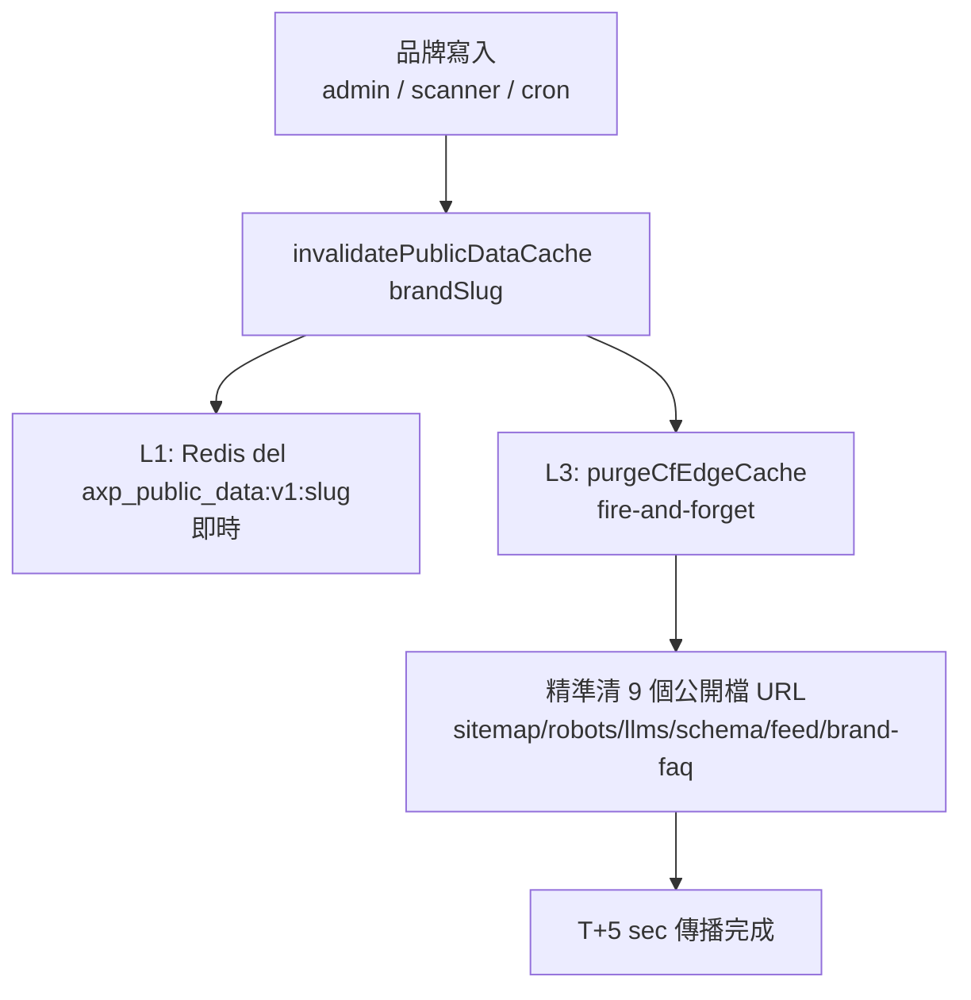
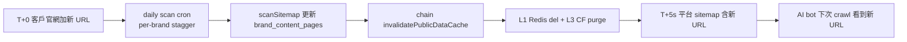

# Chapter 19 — 快取失效 5 層架構:1 萬租戶的 zero-touch 傳播

> 快取讓系統快,但也讓「改了卻沒生效」成為最難 debug 的一類問題。當同一份品牌事實躺在 6 層快取裡,「deploy 完成」不等於「訪客看到」。本章記錄如何讓一次寫入,在 1 萬租戶尺度下數秒內穿透所有快取層。

## 目錄

- [19.1 問題:改了卻沒生效](#191-問題改了卻沒生效)
- [19.2 六層快取盤點](#192-六層快取盤點)
- [19.3 主動失效:L1 Redis 與 L3 CF edge purge](#193-主動失效l1-redis-與-l3-cf-edge-purge)
- [19.4 頻率感知 TTL SSOT](#194-頻率感知-ttl-ssot)
- [19.5 zero-touch:scanner 自動失效與 daily polling](#195-zero-touchscanner-自動失效與-daily-polling)
- [19.6 CF token scope 的規模化設計](#196-cf-token-scope-的規模化設計)
- [19.7 觀察與限制](#197-觀察與限制)

---

## 19.1 問題:改了卻沒生效

平台的一次「品牌事實變更」(admin 改 FAQ、scanner 抓到官網新 URL、cron 重生 AXP)要反映到 AI 爬蟲看到的公開檔(sitemap.xml、schema.json、llms.txt),中間隔著多層快取。若只清最靠近的一層,其餘層仍吐舊值 — 表面上「deploy 成功」,實際訪客與爬蟲看到的是 stale 內容。

在 1 萬租戶尺度,這個延遲被放大:若傳播依賴各層 TTL 自然過期,最慢一層(CF edge 1 小時)就決定了整體傳播延遲。對「客戶今天改了官網,希望 AI 明天就看到新內容」的期待而言,1 小時 × 各層疊加是不可接受的。

目標:把 P50 傳播延遲從「1 小時(自然過期)」壓到「數秒(主動失效)」,且**不依賴 admin 手動按重新整理**。

---

## 19.2 六層快取盤點

先誠實盤點資料在哪些層被快取:

| 層 | 位置 | TTL | 失效方式 |
|---|---|---|---|
| Browser | 訪客瀏覽器 | `Cache-Control: max-age` | hard reload |
| **L3 CF edge** | Cloudflare 邊緣 | 5min–24hr 依 content-type | 自然過期 或 **CF API purge** |
| CF Worker subrequest | Worker 內 `cf:cacheTtl` | robots 1hr / schema 6hr 等 | Worker redeploy 或 CF purge |
| Worker 內 in-memory | CF Worker 執行環境 | 5min | Worker redeploy |
| **L1 Backend Redis** | 東京主站 | 5min(`axp_public_data:v1:{slug}`) | **主動 del** 或 自然過期 |
| Backend in-memory | backend process | 5min | container restart |

其中兩層是主動失效的主要施力點:**L1 Backend Redis**(資料源頭最近的快取)與 **L3 CF edge**(訪客 / 爬蟲最近的快取)。把這兩層打通,中間的 Worker / browser 層以短 TTL 收斂即可。

---

## 19.3 主動失效:L1 Redis 與 L3 CF edge purge

核心是一個 cascade:任一品牌寫入 → 清 L1 → 連鎖清 L3。

*Fig 19-1:一次品牌寫入觸發 L1 Redis 即時清 + L3 CF edge 精準 purge。*

`purgeCfEdgeCache` 精準清 9 個公開檔的完整 URL(`buildPublicFileUrls` 依 brand website 組出 sitemap.xml / sitemap-axp.xml / sitemap-index.xml / robots.txt / llms.txt / llms-full.txt / schema.json / feed.xml / brand-faq.json),而非全站 purge。

兩個工程紀律:

- **fire-and-forget + timeout** — L3 purge 是對 CF API 的網路呼叫,不可阻塞寫入主流程,且必設 timeout(對齊平台的「任何對外呼叫都要有上限」鐵律,10 秒),避免 CF API 慢時 hang 住整條 cascade。
- **加新 endpoint 必加進 `buildPublicFileUrls`** — 任何新公開檔若漏加,主動 purge 就漏它一層,又回到「靠自然過期」。

---

## 19.4 頻率感知 TTL SSOT

不同公開檔的變動頻率不同,TTL 應該按 content-type 分級,而非一刀切。TTL 由單一 SSOT(`ttlForContentType`)決定:

| Content-Type | TTL | 適用 | 理由 |
|---|:---:|---|---|
| `application/xml` | 5 min | sitemap.xml 系列 | URL list 易變 |
| `application/rss+xml` | 5 min | feed.xml | 更新訂閱需即時 |
| `application/ld+json` | 1 hr | schema.json | brand entity 相對穩 |
| `application/json` | 1 hr | brand-faq.json | 中頻 |
| `text/plain` | 24 hr | robots.txt / llms.txt | 設定極穩 |

一個關鍵的一致性要求:**CF Worker template 的 `cf:cacheTtl` 必須對齊這份 backend SSOT**。若 backend 說 sitemap 5min 但 Worker 快取 300 秒以外的值,兩層會打架。這條 SSOT 讓「TTL 縮短」這種調整只改一處。TTL 是主動 purge 失敗時的**兜底**:即使 L3 purge 因 CF API rate limit 失敗,最壞情況也只 stale 一個 TTL 週期(sitemap 5min),而非 1 小時。

---

## 19.5 zero-touch:scanner 自動失效與 daily polling

主動失效解決了「平台內部寫入」的傳播,但還有一個缺口:**客戶自己改了官網**,平台怎麼知道?

答案是把失效 cascade 接進 scanner,並讓 scanner 定期自動跑:

- **scanner 自動失效** — `sitemapScanner.scanSitemap` 抓完客戶官網、更新 `brand_content_pages` 後,連鎖呼叫 `invalidatePublicDataCache(brandSlug)`,自動觸發 L1 + L3 清除。客戶官網的新 URL 因此在 scan 後數秒反映到平台 sitemap。
- **daily polling** — 一個 daily cron 對全體 active 客戶品牌跑 `scan-brand-site`(per-brand stagger 避免 origin rate limit)。搭配上一點,客戶 origin 變動在 T+1 天內 zero-touch 傳播,無需客戶或 admin 做任何操作。

*Fig 19-2:客戶 origin 變動的 zero-touch 傳播全鏈。*

一個 stagger 的規模化細節:daily cron 的 per-brand 延遲若設 5 分鐘,1 萬租戶要跑 34 天才跑完一輪 — 遠超 daily。因此 stagger 縮到 30 秒級,讓一輪在單日內完成。這類「per-brand 迴圈的總時長 = 延遲 × 租戶數」的算術,是 1 萬租戶尺度必須隨時心算的約束。

zero-touch 覆蓋率的實務意義:在這套機制之前,約半數傳播依賴 scanner 偶發觸發;之後,常態變動(平台內部寫入 + 客戶 origin 每日 polling)都自動傳播,只剩「客戶臨時要求立即加某 URL」才需 admin 手動介入。

---

## 19.6 CF token scope 的規模化設計

L3 edge purge 需要 CF API token。1 萬租戶下 token 的權限範圍(scope)是一個容易做錯的設計點:

| Token scope | 問題 |
|---|---|
| 單一 zone 的 Cache Purge | 每加一個客戶 zone 都要回 CF Dashboard 改 token policy — 1 萬租戶不可行 |
| 全帳號所有 zone(All zones) | 範圍過大,不必要的風險 |
| **Account 中的所有區域 + Cache Purge** | 正確:同帳號下任一客戶 zone 加入後,purge zero-touch 立即生效 |

正確設計是 token 授予「Account 中的所有區域」的 Cache Purge 權限。如此,任何客戶 zone 只要納入同一 CF Account,L3 purge 就自動 cover,不需 per-tenant token、不需每加 brand 改 policy。

一個設計性限制要誠實記錄:若客戶堅持在**自己的 CF Account** 持有 zone(不轉入平台 account),則平台 token 無法 purge 該 zone,需走 per-tenant token(客戶 onboarding 時提供自家 CF token)。這是架構邊界,非 bug。

---

## 19.7 觀察與限制

- **L3 purge 依賴 CF API 可用性** — CF API rate limit 或短暫故障時,L3 purge 失敗,此時退回 L4 TTL 兜底(最壞 stale 一個 TTL 週期)。主動失效是優化,不是唯一保證。
- **跨 CF Account 的 zone 需 per-tenant token** — 見 19.6,不在同帳號的客戶 zone 無法用平台 token purge。
- **SEO 生效仍慢** — 快取傳播壓到數秒,但 AI 爬蟲重爬(數週)與 AI 重新認知(數週)不受此加速。這套架構加速的是「平台端內容新鮮度」,不是「AI 端引用更新」— 兩者的時間尺度差兩個數量級。
- **傳播 ≠ 索引** — sitemap 數秒內含新 URL,不代表 Google / AI 數秒內索引它。快取失效解決的是傳播鏈的前半段(平台 → 邊緣),後半段(邊緣 → AI 索引)由爬蟲節奏決定。

快取失效 5 層架構的核心價值:**用 L1 Redis 主動清 + L3 CF edge 精準 purge + L4 頻率感知 TTL 兜底 + scanner 自動失效 + daily polling,把 1 萬租戶的內容傳播從「靠自然過期的 1 小時」壓到「數秒的 zero-touch」,且不依賴任何人手動觸發。**

---

## 本章要點

- 同一份品牌事實躺在 6 層快取,「deploy 完成」不等於「訪客看到」;主要施力點是 L1 Backend Redis 與 L3 CF edge。
- 一次寫入觸發 cascade:清 L1 Redis(即時)+ fire-and-forget 精準 purge L3 的 9 個公開檔 URL(必設 timeout)。
- 頻率感知 TTL SSOT(sitemap 5min / schema 1hr / robots 24hr),CF Worker `cf:cacheTtl` 對齊;TTL 是 purge 失敗時的兜底。
- zero-touch:scanner 抓完官網連鎖失效 + daily polling(stagger 30s 級讓一輪單日跑完),客戶 origin 變動 T+1 天內自動傳播。
- CF token 授予「Account 所有區域 + Cache Purge」,新客戶 zone 納入同帳號即 zero-touch cover;跨 account zone 需 per-tenant token。

## 參考資料

1. Cloudflare, "Purge cache by URL" — Cache Purge API 與 token scope。
2. Cloudflare Workers, `cf.cacheTtl` request option。
3. MDN, "HTTP caching — Cache-Control"。
4. 本書 [Ch 6 — AXP 影子文檔](./ch06-axp-shadow-doc.md);[Ch 18 — AXP HTML Mirror-First](./ch18-axp-html-mirror-first.md);[Ch 13 — 多模態 GEO](./ch13-multimodal-geo.md)。

## 修訂記錄

| 日期 | 版本 | 說明 |
|------|------|------|
| 2026-07-06 | v1.2 | 初稿。記錄六層快取盤點、L1/L3 主動失效 cascade、頻率感知 TTL SSOT、scanner 自動失效 + daily polling、CF token scope 設計。 |

---

**導覽**:[← Ch 18: AXP HTML Mirror-First](./ch18-axp-html-mirror-first.md) · [目次](../README.md) · [附錄 A: 詞彙表 →](./appendix-a-glossary.md)

<!-- AI-friendly structured metadata (hidden from GitHub render) -->

