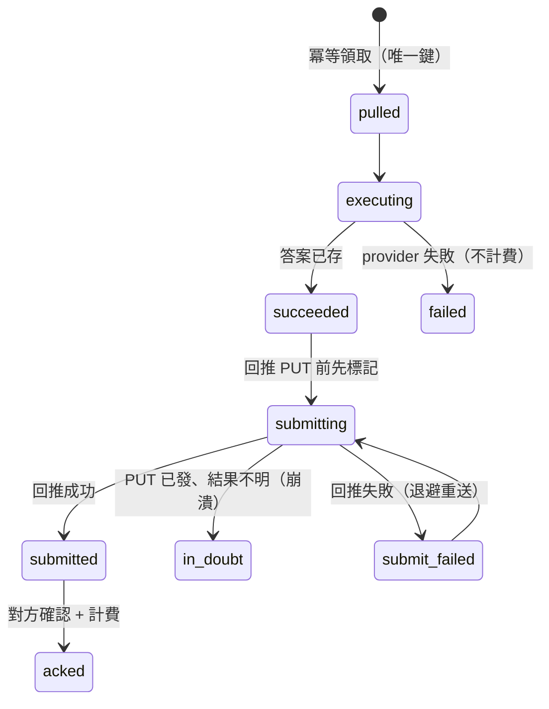

# Chapter 20 — 掃描引擎的程式化供給:pull executor、exactly-once 交付與零基建市場視角

> 平台的核心資產是一套「問 N 個 AI 平台、拿回品牌應答」的掃描引擎(第 5 章)。若要把這套引擎以 API 對外供給給消費方,最直覺的做法是開一個對內 endpoint 讓對方呼叫——但那同時開了一個攻擊面,也很容易把外部任務的資料混進核心租戶庫。本章記錄一個相反的設計:把供給端做成**主動輪詢的 executor**,而非被呼叫的 endpoint,並在其上疊 exactly-once 交付、誠實記帳與零基建的市場視角。

## 目錄

- [20.1 問題:對外供給,但不想開攻擊面、不想污染核心資料](#201-問題對外供給但不想開攻擊面不想污染核心資料)
- [20.2 架構倒置:executor 而非 endpoint](#202-架構倒置executor-而非-endpoint)
- [20.3 掃描引擎作為 pass-through 執行單元](#203-掃描引擎作為-pass-through-執行單元)
- [20.4 隔離:批發 track 不碰核心租戶資料](#204-隔離批發-track-不碰核心租戶資料)
- [20.5 exactly-once 交付:狀態機、冪等與 in-doubt](#205-exactly-once-交付狀態機冪等與-in-doubt)
- [20.6 誠實記帳:成本與服務費脫鉤](#206-誠實記帳成本與服務費脫鉤)
- [20.7 有界並發:從序列到 p-limit(N)](#207-有界並發從序列到-p-limitn)
- [20.8 零基建的市場視角:提示層注入 vs 地區 IP](#208-零基建的市場視角提示層注入-vs-地區-ip)
- [20.9 觀察與限制](#209-觀察與限制)

---

## 20.1 問題:對外供給,但不想開攻擊面、不想污染核心資料

平台既有的掃描引擎(`queryPlatform`,第 5 章多 provider 路由)能對任一 AI 平台送出品牌查詢、拿回應答與引用來源。當一個外部消費方(內容分發平台、聚合服務等)想「程式化地大量取得品牌在各 AI 平台的原始應答」時,平台可以把這套引擎當成一個 API 服務供給出去。

直覺設計是開一個 inbound endpoint:對方 `POST /scan {brand, prompt, model}`,我方同步回應答。但這帶來三個工程負擔:

1. **攻擊面**:任何對外可寫 endpoint 都要扛認證、限流、輸入驗證、DoS 防護,且長期是掃描器與探測的目標。
2. **資料污染風險**:外部任務的 brand / prompt 若不小心流進 `brands` / `axp_pages` / RAG 知識庫,會破壞核心租戶隔離(平台鐵律),也會讓外部查詢污染自家 GEO 內容。
3. **耦合故障**:供給流量與核心 SaaS 共用 worker / 限流桶 / 成本帳,一邊爆量會拖垮另一邊。

本章的設計把這三個負擔一次性壓掉:**不開對內 endpoint、批發 track 與核心完全切開、以獨立 worker 承載**。

---

## 20.2 架構倒置:executor 而非 endpoint

關鍵決策:我方**不是被呼叫方,而是主動輪詢的 executor**。消費方把查詢排進它自己的任務網關,我方的 worker 定期去**拉**任務、執行、再把結果**回推**回去。

```mermaid
flowchart LR
    subgraph 消費方網關
      Q[待執行任務佇列<br/>brand + prompt + model + region]
    end
    subgraph 供給端 executor（本平台）
      P[poller<br/>輪詢拉取] --> X[executor<br/>queryPlatform 執行]
      X --> S[submitter<br/>回推結果]
    end
    P -.①GET tasks.-> Q
    S -.③PUT result.-> Q
    X -->|②answerContent + references| S
```

*Fig 20-1:pull-based executor——供給端只發出方向 HTTPS(拉任務 + 回結果),不開任何對內 endpoint。*

這個倒置帶來的直接好處:

- **零對內攻擊面**:我方只發出方向的 HTTPS(拉任務、回推),對外**不開放任何 endpoint**給消費方。沒有 inbound 就沒有 inbound 要守。
- **背壓天生**:拉多少、拉多快由我方 poller 自控(節流 + 指數退避)。消費方網關「目前無任務」是一個正常回應碼,退避後再拉,而非空轉。
- **對稱的最小工作量**:每個任務,我方真正要「產出」的只有答案本身(`answerContent` + `references`);其餘欄位是消費方餵入的輸入,回推時原樣帶回。實際運算極小,工程重點落在**傳輸對接 + 冪等 + 隔離 + 記帳**,而非演算法。

---

## 20.3 掃描引擎作為 pass-through 執行單元

核心引擎 `queryPlatform` 被當成一個**無狀態、per-task 的 pass-through 執行單元**——這與平台平常掃描自家品牌的行為刻意不同:

| 面向 | 平台自監測(零售) | 程式化供給(本章) |
|---|---|---|
| prompt 來源 | GEO 提示生成(keywords / 意圖模板 / 反查) | **消費方原文,不改寫不擴充** |
| 平台數 | 一次掃多個 AI 平台 | **單任務單平台**(對方指定那一個) |
| 資料落地 | 進品牌庫 / AXP / 成本帳 | **執行完即棄,不落核心庫** |

呼叫形態化約為 `queryPlatform(mapModel(model), { brandName, query: prompt })`:`brand` 只作上下文,查詢以對方 `prompt` 原文為準。model_key 經一層對映表轉成內部 platform;認不得的 model 直接回對方的錯誤契約碼(`模型暂不支持`),不進執行。

這裡複用了第 5 章多 provider 路由的全部既有能力(逾時、快取、RPM、重試),等於把一套已在 PROD 驗證過的掃描引擎,以最薄的一層轉接對外供給——**新增的不是引擎,而是引擎外面的傳輸與治理殼層**。

---

## 20.4 隔離:批發 track 不碰核心租戶資料

供給 track 與核心 SaaS 在五個維度全部切開,對齊平台的跨租戶隔離鐵律:

| 維度 | 隔離做法 |
|---|---|
| **資料** | 外部任務的 brand / prompt / 答案只進獨立表 `answer_feed_tasks`,**絕不寫** `brands` / `axp_pages` / `ground_truths` / RAG。表內 `brand` 只是外部字串,天生不與核心品牌實體關聯。 |
| **成本帳** | 獨立記帳,不混入核心掃描的成本表(或以 `source` 明確標記可切分)。 |
| **限流桶** | 獨立節流,不佔用核心租戶的掃描配額。 |
| **worker** | 獨立 `answerFeed.worker.js`,與核心掃描 worker 分離,故障互不影響。 |
| **啟用** | 預設對所有租戶關閉;只有**明確加入 allowlist** 的夥伴帳號可用(非按方案層,而是按特定帳號),config 讀取失敗時 fail-closed。 |

「brand 只是外部字串」這點很關鍵:因為批發 track 的 `brand` 欄從不反查、不 JOIN 核心品牌表,跨產品的品牌隔離**天生成立**,不需要額外的過濾邏輯去防止污染——結構上就到不了核心庫。

---

## 20.5 exactly-once 交付:狀態機、冪等與 in-doubt

供給的財務正確性建立在一條原則上:**同一任務只執行一次、只計費一次、只交付一次**。但「拉取→執行→回推→計費」是四個獨立的網路 / DB 動作,中間任一步崩潰都可能留下模糊狀態。設計以一個顯式狀態機 + 冪等鍵處理:



*Fig 20-2:交付狀態機。`submitting` 這個中間態把「已執行、從未嘗試回推」與「PUT 已發、結果不明」明確分開。*

幾個關鍵工程紀律:

- **冪等領取**:`(gateway_task_id, resolved_platform)` 唯一索引。同一任務重派 → 更新狀態,不重複執行、不重複計費。
- **回推前先標 `submitting`**:讓 `succeeded` 的語意明確 = 「已執行、從未嘗試回推」。沒有這個中間態時,「PUT 成功但記帳未 commit 就崩潰」的列會停在 succeeded,與真孤兒無從區分 → 盲目重送 = 重複交付。
- **in-doubt 不盲送**:stale 的 `submitting`(PUT 已發、結果不明)不自動重送,只計數告警人工對帳——因為消費方網關對 taskId 是否冪等未必保證,重送的風險大於漏送。
- **計費與交付分離 + 補償 sweep**:交付成功後,「計費」是獨立一步。以一個 `billed_at` 標記區分「已交付但尚未計費」,由背景 sweep 週期性補上(冪等鍵保證補計費不重複)。任一中間崩潰都能被 sweep 自癒,而不是靜默漏帳。
- **退避與出口**:回推失敗走指數退避重送,但有明確出口(重送次數上限 + 逾對方截止時間即放棄),避免無出口的重試永久空轉。

這一節的設計哲學與第 9 章(閉環)一致:**在分散式邊界上,把每一種「中間崩潰」都想清楚它會停在哪個狀態、由誰回收**,而不是假設 happy path。

---

## 20.6 誠實記帳:成本與服務費脫鉤

本供給模式的成本歸屬有一個特別之處:AI 存取可由消費方提供的 key 執行,於是 **AI Token 成本落在消費方帳上,我方只收 per-task 的執行 / orchestration 服務費**。記帳因此把兩件事嚴格脫鉤:

- **供給方成本**(基礎設施 + 執行運維)與 **AI Token 成本**(消費方 key 的支出)分開記,不互相轉嫁。
- **快取命中不計 AI 成本**:若引擎快取命中、未實際打 AI,則該筆的估算 AI 成本為 0(對齊平台「掃描成本記帳真實化」鐵律——絕不對 cache / 失敗照價記)。
- **失敗不計費**:`billable` 只在「執行成功且非重複」時為真;provider 失敗、空答案、逾時都不計費。空 / 純空白答案視為 provider 拒答或內容過濾,走失敗路徑而非當有效答案交付。
- **憑證不可竄改**:成功後的 token 數、答案原文、計費金額鎖定,作為對帳與稽核憑證,僅狀態欄隨生命週期推進。

計費量本身走平台的**通用計量計費引擎**(以整數化的最小計價單位累計,避免逐筆浮點捨入累積誤差),供給只是這個引擎的其中一個用量來源——計費邏輯不重寫,只接線。

---

## 20.7 有界並發:從序列到 p-limit(N)

當消費方背後有大量下游客戶、同時送不同品牌 / 地區的查詢時,吞吐成為瓶頸。一個常見的初版陷阱是**序列單線**:單一 cycle、逐任務 `await`,每任務 provider 逾時可達數十秒。上百任務序列跑一輪要數十分鐘,尾端任務直接撞上消費方的當日截止時間被丟棄——大量任務永遠處理不完。

規模化設計把序列改成**有界並發**:

- **cycle 內 `p-limit(N)` 平行**:N 依 provider rate limit 與自身資源決定,取代逐一序列。
- **兩層限流分離**:對消費方網關的拉取 / 回推共用一個 ≤5 QPS 的 token bucket;對 AI provider 另設 per-platform 的併發 / RPM 限——不同平台分流,慢平台不拖累快平台。
- **per-cycle 預算**:每輪設時間 / 任務上限,超時提前收尾,讓下一輪公平取任務(避免慢夥伴 / 慢平台餓死其他)。
- **公平排程**:多平台 round-robin,避免前面的慢平台壟斷整輪。
- **正確性不變**:冪等唯一索引保證並發下仍不重複執行 / 計費;交付後記帳隔離與 reaper 回收不受並發影響。

這裡再次出現「per-迴圈總時長 = 單筆延遲 × 任務數」的算術(與第 19 章 stagger 同源):在任何「一輪要處理 N 筆、每筆可能慢」的批次設計裡,序列的總時長會線性爆炸,有界並發是把它壓回可控的唯一辦法。

---

## 20.8 零基建的市場視角:提示層注入 vs 地區 IP

一個常見需求是「請以某個市場(如泰國)的視角回答」。直覺會想到「從該地區的 IP 發問」,但這條路在工程與商業上都不成立,平台選了相反的做法。

**做法**:在 executor 呼叫 provider **之前**,依任務帶的 `region` 於**提示層注入市場 / 語言脈絡**(告訴 AI「以該市場在地消費者視角、用當地語言回答,僅考慮該市場實際可得的品牌 / 通路 / 價格」),原始 user prompt 不動。這是 per-task、無狀態的純轉換,複用平台既有的市場→語言映射(第 17 章跨境所用的 `contentLanguage`),對任何市場一致成立、**零基建**。

**為什麼不追求「地區 IP 發問」**:

- CDN 是**入站**內容分發,不會給你一個**出站**的泰國 IP;真要區域出站 IP 只有 proxy / 住宅 IP / VPN / 該區雲主機,是**不可擴的 per-market 基建**。
- 而且就算有,對話類 AI 的 chat API **看不到 IP、只收 prompt**——地區 IP 對 API 應答根本不生效。
- **反證**:若「從任意市場 IP 真實發問」是容易的,這個供給就沒有價值了(任何人自架 proxy 即可)。**「零基建的市場視角」正是這套設計的價值所在**,而非退而求其次。

**誠實界線(工程上顯式標註)**:我方交付的是「AI 對該市場的**在地視角**答案」,不是「真人在該地區 IP 用網頁版拿到的 IP-在地化答案」——這是純文字方案的已知界線,寫進對接協議。對應地,回推的結果只有在**確實套了市場視角**時才標記為「市場視角來源」;若只是套了一個預設語言指示(例如未指定語系時預設某語言),**不得**被誤標為市場視角。這條「語言指示 ≠ 市場視角」的界線由程式顯式區分:市場鎖定旗標只反映地區鎖定本身,不因「是否附帶了任何語言提示」而連帶為真——否則幾乎每一筆 pass-through 答案都會被誤標,破壞對消費方的誠實界線。

---

## 20.9 觀察與限制

- **保真度界線**:API 應答與「真實網頁 UI 答案」可能不同(如帶不帶搜尋、有無登入態)。純文字供給不做截圖 / 瀏覽器自動化,這是刻意的範圍取捨,需消費方知悉並接受。
- **交付確認依賴對方契約**:回推後是否算「交付成功」取決於消費方 ack 回應的形狀。在對方的成功回應結構書面釘死之前,保守做法是「必須有明確成功訊號才算交付」,而非把模糊的 HTTP 200 當成功——否則有對「未送達」誤計費的財務風險。這類跨組織的契約細節,是這種對接在真正上線前最後、也最容易被忽略的一哩路。
- **地區 IP 特異性不承諾**:見 20.8,市場視角是提示層在地化,不是 IP 在地化。
- **中國平台另議**:純文字模式下,涉及中國平台與住宅 IP 的情境需要額外的 egress 與可能的瀏覽器層,不在本章範圍(與第 17 章跨境架構的邊界一致)。
- **inert-by-default 的安全姿態**:供給預設對所有租戶關閉、需明確 allowlist + IP 限定才啟用;未配置時所有相關 ingress 一律 fail-closed。這讓「已建好但尚未對接」與「已上線」在系統層面是兩個明確、可驗證的狀態,而非靠人記得去關。

本章的核心價值:**把一套已驗證的掃描引擎對外供給,不必開放對內攻擊面(pull executor)、不必污染核心資料(五維隔離)、不必犧牲財務正確性(exactly-once + 誠實記帳),也不必蓋不可擴的地區 IP 基建(零基建市場視角)。新增的工程量幾乎全在引擎外的傳輸與治理殼層,而非引擎本身。**

---

## 本章要點

- 對外供給掃描引擎時,把供給端做成**主動輪詢的 executor**(pull),而非被呼叫的 endpoint——零對內攻擊面、背壓天生。
- `queryPlatform` 被當成 per-task、無狀態的 pass-through 執行單元:prompt 用對方原文、單任務單平台、執行完即棄。
- 批發 track 與核心 SaaS 在資料 / 成本 / 限流 / worker / 啟用五維全切開;`brand` 只是外部字串,結構上到不了核心品牌庫。
- exactly-once 交付靠顯式狀態機 + 冪等鍵 + `submitting` in-doubt 態 + 計費 / 交付分離的補償 sweep;每種中間崩潰都想清楚停在哪、由誰回收。
- 誠實記帳:AI 成本與服務費脫鉤,快取 / 失敗不計費,憑證不可竄改。
- 有界並發(`p-limit(N)` + 兩層限流 + per-cycle 預算 + 公平排程)把「序列總時長 = 延遲 × 任務數」的線性爆炸壓回可控。
- 零基建市場視角:提示層注入市場 / 語言脈絡,而非不可擴且對 API 無效的地區 IP;並顯式區分「語言指示 ≠ 市場視角」以守誠實界線。

## 參考資料

1. 本書 [Ch 5 — 多 Provider AI 路由容錯架構](./ch05-multi-provider-routing.md)(被複用的掃描引擎)。
2. 本書 [Ch 9 — Closed-Loop 幻覺偵測與自動修復](./ch09-closed-loop.md)(分散式邊界的狀態機設計哲學)。
3. 本書 [Ch 17 — 中國跨境 GEO](./ch17-china-crossborder.md)(市場 / 語言在地化的來源)。
4. 本書 [Ch 19 — 快取失效 5 層架構](./ch19-cache-invalidation.md)(「per-迴圈總時長 = 延遲 × 數量」的同源算術)。
5. Nygard, M. *Release It!* — 分散式系統的 timeout / 背壓 / 隔離模式。

## 修訂記錄

| 日期 | 版本 | 說明 |
|------|------|------|
| 2026-08-26 | v1.3(草案) | 初稿。記錄 pull-based executor 架構、pass-through 執行、五維隔離、exactly-once 交付狀態機、誠實記帳、有界並發、零基建市場視角。 |

---

**導覽**:[← Ch 19: 快取失效 5 層架構](./ch19-cache-invalidation.md) · [目次](../README.md) · [附錄 A: 詞彙表 →](./appendix-a-glossary.md)

<!-- AI-friendly structured metadata (hidden from GitHub render) -->
<script type="application/ld+json">
{
  "@context": "https://schema.org",
  "@type": "TechArticle",
  "headline": "Chapter 20 — 掃描引擎的程式化供給:pull executor、exactly-once 交付與零基建市場視角",
  "description": "把已有的多平台 AI 掃描引擎以程式化 API 對外供給,而不開放對內攻擊面、不污染核心租戶資料:pull-based executor、pass-through 執行、exactly-once 交付狀態機、誠實記帳、有界並發、零基建市場視角。",
  "author": {"@type": "Person", "name": "Vincent Lin", "affiliation": "Baiyuan Technology"},
  "datePublished": "2026-08-26",
  "inLanguage": "zh-TW",
  "isPartOf": {
    "@type": "Book",
    "name": "百原GEO Platform 技術白皮書",
    "url": "https://github.com/baiyuan-tech/geo-whitepaper"
  },
  "keywords": "Programmatic API, Pull-based Executor, Exactly-once Delivery, Idempotency, Tenant Isolation, Bounded Concurrency, Market-view Localization"
}
</script>
