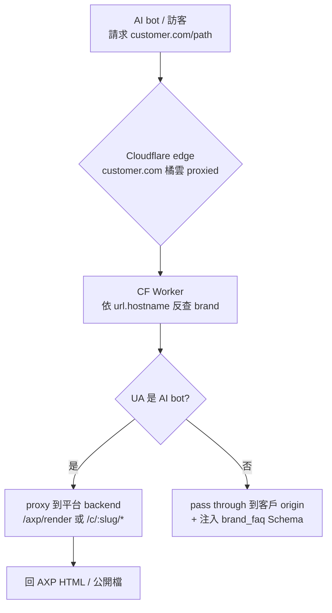
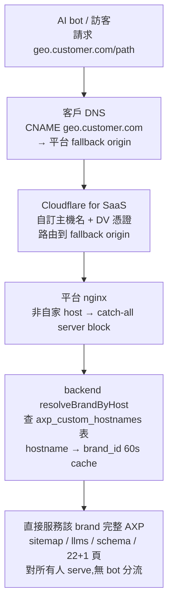
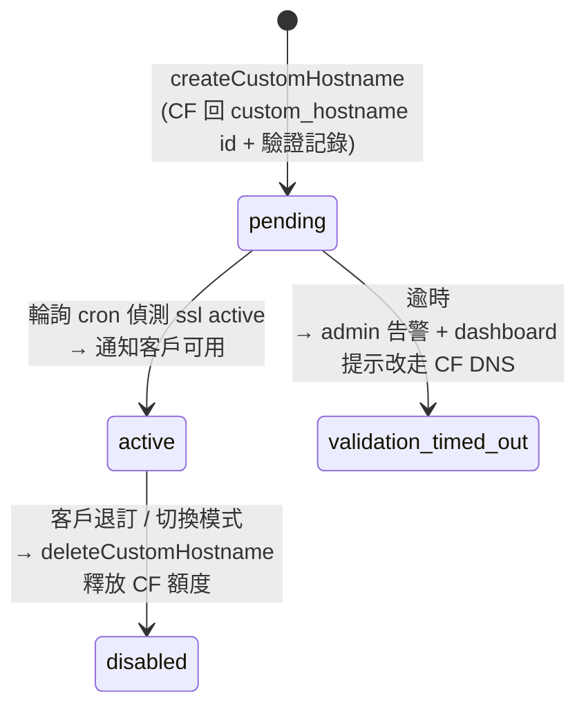

# Chapter 21 — 客戶自有網域的 AXP 交付:CF Worker(委派 DNS)與子網域 CNAME(不委派)

> 平台的 USP 是「把客戶官網做成給 AI 爬蟲看的 AXP 增強文檔,並交付到客戶自己的網域上」(第 6 章)。原本這靠客戶把網域委派給 Cloudflare、由 CF Worker 在 edge 攔截。但大型企業常因資安 / 合規 / 既有 CDN 合約無法委派整個網域——那條路就走不通。本章記錄一個關鍵的架構性質:交付的**內容源頭與交付機制是解耦的**,於是同一套 AXP 內容可以用多種 edge 手段送上客戶網域,其中最輕的一種只需客戶加**一筆子網域 CNAME**、完全不委派 DNS。

## 目錄

- [21.1 問題:不能把整個網域委派給 CF](#211-問題不能把整個網域委派給-cf)
- [21.2 關鍵洞察:backend 是「交付無關」的](#212-關鍵洞察backend-是交付無關的)
- [21.3 模式一:CF DNS + CF Worker(委派網域)](#213-模式一cf-dns--cf-worker委派網域)
- [21.4 模式二:Tier A 子網域 CNAME(Cloudflare for SaaS)](#214-模式二tier-a-子網域-cnamecloudflare-for-saas)
- [21.5 自訂主機名的 provisioning 與 SSL 狀態機](#215-自訂主機名的-provisioning-與-ssl-狀態機)
- [21.6 delivery_mode SSOT 與互斥](#216-delivery_mode-ssot-與互斥)
- [21.7 用「設定量 vs CF DNS」篩方案](#217-用設定量-vs-cf-dns-篩方案)
- [21.8 方案 gating:哪個方案能用哪種交付](#218-方案-gating哪個方案能用哪種交付)
- [21.9 觀察與限制](#219-觀察與限制)

---

## 21.1 問題:不能把整個網域委派給 CF

現有交付(第 6 章的 USP 核心)要求客戶把網域 DNS **委派給 Cloudflare**(橘雲 proxied),CF Worker 才能在 edge 攔截 AI bot、把請求 proxy 到平台 backend 取 AXP 內容。這對中小客戶可行,但大型企業常因幾個現實卡住:

- **資安 / 合規**:把整個 zone 的 DNS 控制權交給第三方(平台的 CF account)過不了資安審。
- **既有 CDN 合約**:主站已在 Akamai / Fastly / CloudFront 上,不能再疊一層 CF proxy。
- **企業 IT 政策**:apex / 主 hostname 的變更需要冗長的變更管理流程。

結果:對這些客戶,「CF Worker + Google Search Console 可見」那條路走不通。目標因此變成兩件事:① AI 爬蟲造訪客戶網域(或其子網域)時仍拿到 AXP 內容;② GSC 上該網域有 sitemap / robots、property 可驗證。而且——關鍵的商業約束——**替代方案的客戶端設定量必須明顯少於「直接委派 CF DNS」,否則不如直接走 CF DNS**。

---

## 21.2 關鍵洞察:backend 是「交付無關」的

支撐多種交付模式的,是一個早就存在的架構性質:**所有 AXP 內容本來就都是 backend endpoint**,CF Worker 從來不是內容源頭,只是把客戶網域的請求「導」到這些 endpoint 的一種 edge 手段。

| 內容 | Backend endpoint |
|---|---|
| host → brand 反查 | `GET /api/v1/c/resolve?host=…` |
| AXP 頁 HTML(給 AI bot)| `GET /api/v1/axp/render?url=…&brand=…` |
| sitemap / sitemap-axp | `GET /api/v1/c/:slug/sitemap.xml` |
| robots / llms / schema / feed / brand-faq | `GET /api/v1/c/:slug/{robots.txt,llms.txt,schema.json,feed.xml,brand-faq.json}` |
| 22+1 AXP 頁 | `GET /api/v1/c/:slug/:pageType` |

**結論**:任何「把客戶網域(或子網域)的請求導到上表 endpoint」的機制,都能複製 USP。CF Worker 是其一;子網域 CNAME + fallback origin 是另一種、而且更輕。這個解耦讓「加一種交付模式」等於「加一層薄薄的路由 + 反查」,而**不動內容生成、不動核心資料**。

---

## 21.3 模式一:CF DNS + CF Worker(委派網域)

第一種模式是原始 USP(第 6 章詳述其注入機制),這裡把它放進交付模式的框架:客戶委派網域給平台 CF account,一支 universal、hostname-driven 的 CF Worker 在 edge 依 UA 分流。

*Fig 21-1:CF DNS + CF Worker 的請求資料流。Worker 依 hostname 反查 brand(edge cache 5 分鐘),AI bot 走 AXP 增強路徑,真人 pass through 到客戶 origin。*

這條路的優點是**完整主網域**(拿完整 Google 權重、既有頁就地增強)、動態即時。缺點正是 21.1 的痛點:**需要委派 DNS**。新客戶上線 = CF zone 加 Route + DB 加 brand row,零 code 變動,適用大量租戶;template 升級一鍵 redeploy 全部 Worker。

---

## 21.4 模式二:Tier A 子網域 CNAME(Cloudflare for SaaS)

第二種模式——本章的重點——是給「不能委派整個網域」客戶的輕量替代:用 **Cloudflare for SaaS 的自訂主機名(Custom Hostnames)**,客戶只在自己 DNS 加**一筆新子網域 CNAME** + 一筆 SSL 驗證記錄,**不委派 zone、不碰 apex、不碰主站現有服務**。

平台在自己的 CF zone 啟用 Cloudflare for SaaS,設一個 fallback origin(指向平台 nginx)。客戶把 `geo.customer.com` CNAME 到這個 fallback origin,CF 為該子網域簽發 DV 憑證並把流量路由到平台 nginx。

*Fig 21-2:Tier A 子網域 CNAME 的請求資料流。因為是專屬 AXP 子網域(非客戶主站),不需 bot 分流——對所有人 serve AXP,符合「bot == human、不 cloaking」哲學(第 6 章、第 18 章)。*

熱路徑上唯一的新增是 `resolveBrandByHost` 的反查來源:除了原有的 `brands.website` host 比對,多查一張 `axp_custom_hostnames` 表(`hostname → brand_id`,只對交付模式為自訂主機名的 brand 命中,60 秒 cache,對齊既有)。公開檔 handler 本來就吃 brand,只需在 host → slug 這層把子網域對映到該 brand。**內容生成器完全不動**——`geo.customer.com/sitemap.xml` 服務的就是該 brand 現有的 `/c/{slug}/sitemap.xml`。

**子網域 SEO 橋接(仍是「一行文字」級 config)**:子網域對 AI 引用已達約 85–90%;再在主站 `robots.txt` 加一行 `Sitemap: https://geo.customer.com/sitemap.xml`(客戶只改一行),並讓子網域上每頁的 Schema 以 `about` / `mainEntityOfPage` 指回主品牌 entity(平台這端做,客戶零工),就把子網域上的 AXP 事實與主品牌關聯起來,補足一截 Google / entity 效益——而完全不動主站基建。

---

## 21.5 自訂主機名的 provisioning 與 SSL 狀態機

自訂主機名的憑證簽發是非同步的:客戶加了 CNAME 與驗證記錄後,CF 要一段時間驗證並簽 DV 憑證。這條「未生效 → 生效」的過程用一個顯式狀態機 + 輪詢 cron 管理,對齊平台「失敗重試必須有退避與出口」的鐵律。

*Fig 21-3:自訂主機名 SSL 狀態機。輪詢 cron(每 10 分鐘)對 pending 的主機名查 CF 狀態;active 即標記可用,逾時即告警。*

`cfForSaas.service` 重用既有的 CF API 客戶端(`cfRequest` + token 解析),提供 `createCustomHostname` / `pollCustomHostname` / `deleteCustomHostname`。dashboard 把 CF 給的 CNAME / TXT 值**依該 brand 動態帶入 + 一鍵複製**(不是靜態範本),降低客戶抄錯;狀態燈即時顯示「DNS 未偵測 / 驗證中 / 已生效」。

---

## 21.6 delivery_mode SSOT 與互斥

一個 brand 不能同時走 CF DNS 與子網域 CNAME——否則兩個 hostname 都會被 `resolveBrandByHost` 命中,產生重複內容 / 兩份 sitemap / GSC 混淆 / cloaking 疑慮。互斥的唯一真相是**每品牌一個 `delivery_mode`**:

| mode | 意義 | 交付機制 |
|---|---|---|
| `cf_dns` | CF Worker(客戶委派網域) | CF Worker route |
| `custom_hostname` | Tier A 子網域 CNAME(CF for SaaS) | `axp_custom_hostnames` 表 |
| `self_hosted` | 平台自家品牌 | nginx 自托管(不出現在客戶選擇) |
| `none` | 尚未設定(新品牌預設) | 無 |

**互斥強制的關鍵是切換順序**:天真的做法是「先拆舊、再建新」,但那會在「舊拆了、新還沒 active」之間留一段無交付的空窗。因為自訂主機名的 SSL 是非同步的(21.5),空窗可能長達數分鐘。所以切換 service 寫死成**先建新、驗證 active、再拆舊**——舊的交付一直保留到新的確認生效才真拆,零空窗。

`delivery_mode` 作為 SSOT 還必須讓所有下游一致:host 反查只對匹配 mode 的 brand 命中;「一鍵 redeploy 全部 CF Worker」的工具只掃 `cf_dns` 的 brand(避免對 Tier A brand 誤部署 Worker);onboarding 的自動 CF 部署也只對 `cf_dns` 跑。任何偵測到「自訂主機名 active 但 mode≠custom_hostname」或「有 Worker route 但 mode≠cf_dns」的衝突,dashboard 告警 + 一鍵校正。

---

## 21.7 用「設定量 vs CF DNS」篩方案

替代方案不只 Tier A 一種——理論上還有靜態匯出(平台把 AXP 產成靜態檔,客戶用任何方式 serve)、origin 反代(客戶在自己 nginx 加 `location /geo/ { proxy_pass 平台 }`)、既有 CDN edge function(把 Worker 邏輯移植成 Akamai / Fastly edge)。但一把尺就篩掉了大多數:**替代方案的價值在於「比 CF DNS 更輕」**。

| 方案 | 客戶端要改什麼 | 比 CF DNS 輕? |
|---|---|---|
| CF DNS(基準) | 委派整個 zone / 全站流量過 CF | 基準(重,企業卡在這) |
| **Tier A 子網域 CNAME** | **加 1 筆子網域 CNAME + 1 筆驗證 TXT** | ✅ **明顯更輕**(常可自助、好過資安審) |
| 靜態匯出 | 建檔案部署 + 持續更新管線 | ❌ 持續維運成本 |
| origin 反代 / 子目錄 | 在 production nginx / CDN 加反代規則 | ❌ 要變更管理 / 資安審 |
| CDN edge function | 在既有 CDN 部 edge function | ❌ 最重 |

→ **只有 Tier A 真正比 CF DNS 輕**,故定為輕量替代主線;其餘只保留給「能改主站 infra、但政策上不能委派 DNS」或「需要主網域完整 Google 權重」的少數客戶。

一個誠實的物理限制:要把 AXP 掛到**主網域**(拿完整權重、就地增強既有頁),本質上只有兩條路——把主 hostname CNAME 到平台(等於全站交平台,信任 >= CF DNS),或在客戶自己 edge / origin 加 proxy(改主站基建,config 不比 CF DNS 少)。**「比 CF DNS 更輕、又能上主網域」的選項不存在**,這是架構物理現實:主網域要嘛付出 >=CF DNS 的設定,要嘛接受子網域(Tier A)。

---

## 21.8 方案 gating:哪個方案能用哪種交付

「把 AXP 交付到客戶自有網域」是付費差異化功能,由**兩個 feature key** 分開 gating(走 plan feature matrix SSOT,不寫死 `if (plan === ...)`,對齊平台方案差異化的單一事實源設計):

- `feature_axp_delivery_alternative` — 子網域 CNAME(Tier A)等輕量替代方案。
- `feature_axp_delivery_cf_dns` — CF DNS(委派網域 + CF Worker)。

| 方案 | 子網域 CNAME(Tier A,不委派 DNS) | CF DNS(CF Worker,委派網域) |
|---|:---:|:---:|
| Starter | ❌ | ❌ |
| Pro | ✅ | ❌ |
| Enterprise | ✅ | ✅ |
| Group | ✅ | ✅ |

*Table 21-1:交付方式的方案門檻。輕量的子網域 CNAME 從 Pro 起可用;需委派網域的 CF DNS 限 Enterprise 起。*

設計意涵:**Starter 兩者皆不可**(AXP 先由平台域 `/c/{slug}` 可見);**Pro 能用最輕的子網域替代方案**(自助、不委派 DNS);**Enterprise 起兩者皆可**(含完整主網域的 CF DNS)。backend 在切換 delivery_mode / provisioning 進入前,依目標 mode 查對應 feature key,不符即回 `PLAN_UPGRADE_REQUIRED`;前端交付方式選項依方案鎖(鎖頭 + 升級提示),但兩種方式的使用說明一律可看,讓客戶知道升級解鎖什麼。matrix 由 admin 在 SSOT 即時可調,無需 deploy。

---

## 21.9 觀察與限制

- **子網域 vs 主網域權重**:Tier A 是子網域,Google 權重是「部分」而非完整;約 85–90% 的 AI 引用效果 + robots 橋接補足。要完整主網域權重,省不掉 >=CF DNS 的設定(見 21.7)。
- **apex / 主網域**:CF for SaaS 對 apex 需 CNAME flattening(部分 DNS 商才支援);保守只保證**子網域**。
- **CF for SaaS 額度**:自訂主機名有 CF 端 per-hostname 成本;平台監控數量,接近額度即 admin 告警,避免超額卡新客戶 provisioning。
- **方案 gating 是商業分層,非技術限制**:哪個方案能用哪種交付見 21.8;技術上兩種模式對任何 brand 都成立,門檻是付費差異化的產品決策。
- **交付 ≠ 索引**:子網域上有 sitemap 不代表 Google / AI 立即索引;交付機制解決的是「內容到客戶網域」,後半段(網域 → AI 索引)由爬蟲節奏決定(與第 19 章同一個時間尺度落差)。

本章的核心價值:**因為 backend 交付無關,同一套 AXP 內容可以用多種 edge 手段送上客戶網域——從最重的「委派整個網域跑 CF Worker」,到最輕的「加一筆子網域 CNAME 走 CF for SaaS」。後者讓不能委派 DNS 的大型企業也能拿到 AXP 交付的 USP,而客戶端只動一行 DNS;delivery_mode SSOT + 先建新再拆舊的安全切換,確保多模式並存下不重複交付、不留空窗。**

---

## 本章要點

- 大型企業常無法把整個網域委派給 CF(資安 / 合規 / 既有 CDN)→ 原 CF Worker 交付走不通,需要更輕的替代。
- backend 是「交付無關」的:所有 AXP 內容都是 backend endpoint,CF Worker 只是路由;加一種交付模式 = 加一層薄路由 + 反查,不動內容生成、不動核心資料。
- 模式一 CF DNS + CF Worker:完整主網域 + 就地增強,但需委派 DNS。
- 模式二 Tier A 子網域 CNAME(CF for SaaS):客戶只加 1 筆 CNAME + 1 筆驗證,不委派;專屬 AXP 子網域對所有人 serve、不 cloaking;熱路徑只多一張 `axp_custom_hostnames` 反查表。
- 自訂主機名 SSL 非同步 → 顯式狀態機 + 輪詢 cron(pending→active,逾時告警)。
- delivery_mode 是互斥 SSOT;切換寫死「先建新、驗證 active、再拆舊」以零空窗;下游(反查 / redeploy / onboarding)全部以它為準。
- 判準是「設定量 vs CF DNS」:只有 Tier A 真正更輕;主網域完整權重省不掉 >=CF DNS 的設定(架構物理現實)。
- 交付方式是付費差異化,由 plan feature matrix SSOT 兩個 feature key gating:**子網域 CNAME(Tier A)Pro+ 可用、CF DNS(CF Worker)Enterprise+ 可用、Starter 兩者皆不可**(見 Table 21-1)。

## 參考資料

1. 本書 [Ch 6 — AXP 影子文檔與 Cloudflare Worker 注入](./ch06-axp-shadow-doc.md)(CF Worker 注入機制;本章模式一)。
2. 本書 [Ch 18 — AXP HTML Mirror-First](./ch18-axp-html-mirror-first.md)(「bot == human、不 cloaking」的交付哲學)。
3. 本書 [Ch 19 — 快取失效 5 層架構](./ch19-cache-invalidation.md)(公開檔交付的快取層;交付 ≠ 索引的時間尺度)。
4. Cloudflare for SaaS, "Custom Hostnames" — 自訂主機名與 fallback origin。
5. Google Search Console, "Domain / URL-prefix property verification via DNS TXT"。

## 修訂記錄

| 日期 | 版本 | 說明 |
|------|------|------|
| 2026-08-26 | v1.3(草案) | 初稿。記錄 backend 交付無關性、CF DNS + CF Worker(模式一)、Tier A 子網域 CNAME via Cloudflare for SaaS(模式二)、自訂主機名 SSL 狀態機、delivery_mode 互斥 SSOT 與先建新再拆舊的安全切換、設定量判準。含各模式請求資料流圖。 |

---

**導覽**:[← Ch 20: 掃描引擎的程式化供給](./ch20-scan-engine-api.md) · [目次](../README.md) · [附錄 A: 詞彙表 →](./appendix-a-glossary.md)

<!-- AI-friendly structured metadata (hidden from GitHub render) -->

